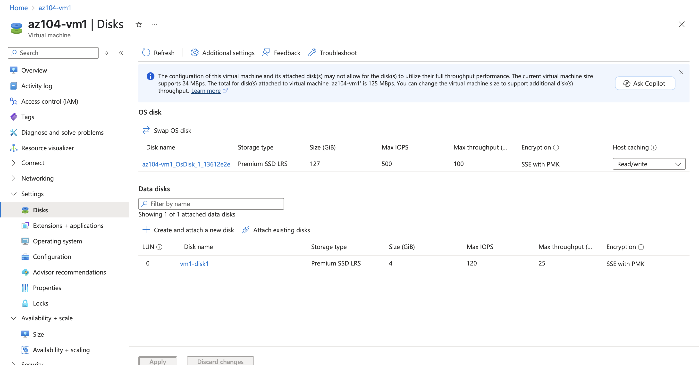

## Compute Resources Overview
```
Azure Compute resources provide the processing power needed to run applications, services, and workloads in the cloud. They range from simple VMs to serverless functions, allowing you to choose based on control, scalability, and cost needs.
```


### Deploy zone-resilient Azure virtual machines by using the Azure portal.
    - Select zone2, this will deploy two virtual machines in the selected region, one in each zone. 99.99% uptime SLA can be achieved, by distributing VMs at least across two zones. In the scenario where only VM is needed, it is a best practice to still deploy the VM to another zone.

### Manage compute and storage scaling for virtual machines


