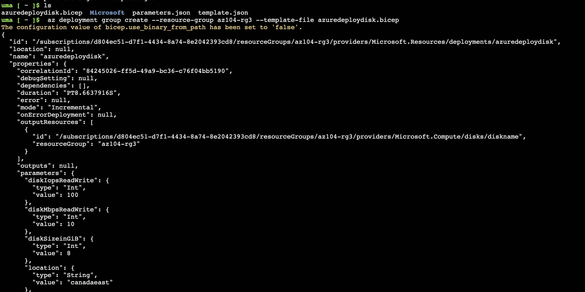

## AZ Governance and Compliance
```
A curated Azure learning path focused on governance, compliance, and hands-on labs.
```
## Overview
```
This repository provides step-by-step labs, scripts, and resources which helped me learn and implement Azure governance and compliance best practices. 

Resources - https://microsoftlearning.github.io/AZ-104-MicrosoftAzureAdministrator/

```
## Topics Covered
```
- Azure Policy and Initiatives
- Role-Based Access Control (RBAC)
- Management Groups and Subscriptions
- Resource Locks and Tagging
- Azure Blueprints
- Compliance Manager and Regulatory Compliance
- Monitoring and Reporting
```
## Lab 01: Manage Microsoft Entra ID Identities

## Key Takeaways
```
- A tenant represents your organization and helps you to manage a specific instance of Microsoft cloud services for your internal and external users.
- Microsoft Entra ID has user and guest accounts. Each account has a level of access specific to the scope of work expected to be done.
- Groups combine together related users or devices. There are two types of groups including Security and Microsoft 365.
Group membership can be statically or dynamically assigned.
- Microsoft EntraID:
Identity provider for authentication and user management.
Cloud-based identity service that manage Users, groups, service principals, MFA, SSO, integrates with Azure and MS 365
- Azure IAM:
Azuthorization layer for Azure resource access.
Refer to RBAC system to authorize users, groups and applications to Azure resources. 
```
## Lab 02a - Manage Subscriptions and RBAC
```
- The root management group is built into the hierarchy to have all management groups and subscriptions fold up to it. This root management group allows for global policies and Azure role assignments to be applied at the directory level. 
- After creating a management group, you would add any subscriptions that should be included in the group.
- As a best practice always assign roles to groups not individuals.
```
### Create a Custom RBAC role
```
{
    "properties": {
        "roleName": "Custom Support Request",
        "description": "A custom contributor role for support requests.",
        "assignableScopes": [
            "/providers/Microsoft.Management/managementGroups/az104-mg1"
        ],
        "permissions": [
            {
                "actions": [
                    "Microsoft.Authorization/*/read",
                    "Microsoft.Resources/subscriptions/resourceGroups/read",
                    "Microsoft.Support/*"
                ],
                "notActions": [
                    "Microsoft.Support/register/action"
                ],
                "dataActions": [],
                "notDataActions": []
            }
        ]
    }
}
```
### Activity Log


## Key Takeaways
```
- Management groups are used to logically organize subscriptions.
- The built-in root management group includes all the management groups and subscriptions.
- Azure has many built-in roles. You can assign these roles to control access to resources.
- You can create new roles or customize existing roles.
- Roles are defined in a JSON formatted file and include Actions, NotActions, and AssignableScopes.
- You can use the Activity Log to monitor role assignments.
- Azure RBAC Roles:
Used to control what users can do with Azure resources
Common Roles - Reader, Contributor, Owner, Storage Blob Data Contributor, Custom Roles.
- Microsoft Entra ID Roles:
Used to control Access to Microsoft Entra Directory-Level resources like Users, Groups, Applications, Conditional and Enterprise Access
Common Roles - Global Admin, User Admin, Application Admin, Security Reader.
```

## Lab 02b - Manage Governance via Azure Policy
```
Azure policies can ensure operational decisions are enforced across the organization. Resource tagging improves reporting.
```


### Key Takeaways
```
- You can assign policies on the management group, subscription, or resource group level. You also have the option of specifying exclusions, such as individual subscriptions, resource groups, or resources. In this scenario, we want the tag on all the resources in the resource group.
- Now you will verify that the new policy assignment is in effect by attempting to create an Azure Storage account in the resource group. You will create the storage account without adding the required tag.
- To verify that the new policy assignment is in effect, you will create another Azure storage account in the same resource group without explicitly adding the required tag.
- Azure tags are metadata that consists of a key-value pair. Tags describe a particular resource in your environment. In particular, tagging in Azure enables you to label your resources in a logical manner.
- Azure Policy establishes conventions for resources. Policy definitions describe resource compliance conditions and the effect to take if a condition is met. A condition compares a resource property field or a value to a required value. There are many built-in policy definitions and you can customize the policies.
- The Azure Policy remediation task feature is used to bring resources into compliance based on a definition and assignment. Resources that are non-compliant to a modify or deployIfNotExist definition assignment, can be brought into compliance using a remediation task.
- You can configure a resource lock on a subscription, resource group, or resource. The lock can protect a resource from accidental user deletions and modifications. The lock overrides any user permissions.
- Azure Policy is pre-deployment security practice. RBAC and resource locks are post-deployment security practice.
```

## Lab 03: Manage Azure Resources Using ARM Templates
```
Automate resource deployments using Azure Resource Manager templates and Bicep templates. There are different ways of deploying the templates.
```
### Architecture Diagram


### Create an Azure Resource Manager template

- Deployed az104-disk1 using Custom deployment--> Quick Start Templates. 
- After Deploying Resource--> Go to Automation blade --> Exported template for the resource.
- Edit the ARM template.
- Go to Custom Deployment Blade --> Build your own template in the editor.
- Edit template blade, click Load file and upload the template.json file you downloaded to the local disk
- Add az104-disk2 and update parameter.json accordingly. Review and create


### Configure the Cloud Shell and deploy a template with PowerShell
```
Deploy Disk Using Poweshell:
Get-AzResourceGroup -Name az104-rg3
$location=(Get-AzResourceGroup -Name az104-rg3).location
$rgName='az104-rg1'
New-AzResourceGroup -Name $rgName -Location $location
Get-AzResourceGroup -Name az104-rg1
$diskConfig = New-AzDiskConfig -Location $location -CreateOption Empty -DiskSize 32 -Sku Standard_LRS
$diskName = 'az104-disk1'
New-AzDisk -ResourceGroupName $rgName -DiskName $diskName -Disk $diskConfig 
Get-AzDisk -ResourceGroupName $rgName -DiskName $diskName

New-AzResourceGroupDeployment -ResourceGroupName az104-rg3 -TemplateFile template.json -TemplateParameterFile parameters.json
```


### Configure the Cloud Shell and deploy a template with CLI
```
uma [ ~ ]$ ls
Microsoft  parameters.json  template.json
uma [ ~ ]$  az deployment group create --resource-group az104-rg3 --template-file template.json --parameters parameters.json
```


### Deploy a resource by using Azure Bicep


```
uma [ ~ ]$ az disk list --output table
Name      ResourceGroup    Location    Zones    Sku           SizeGb    ProvisioningState
--------  ---------------  ----------  -------  ------------  --------  -------------------
diskname  AZ104-RG3        canadaeast           UltraSSD_LRS  8         Succeeded
```
### Key Takeaways

- Azure Resource Manager templates let you deploy, manage, and monitor all the resources for your solution as a group, rather than handling these resources individually.
- An Azure Resource Manager template is a JavaScript Object Notation (JSON) file that lets you manage your infrastructure declaratively rather than with scripts.
- Rather than passing parameters as inline values in your template, you can use a separate JSON file that contains the parameter values.
- Azure Resource Manager templates can be deployed in a variety of ways including the Azure portal, Azure PowerShell, and CLI.
- Bicep is an alternative to Azure Resource Manager templates. Bicep uses a declarative syntax to deploy Azure resources.
- Bicep provides concise syntax, reliable type safety, and support for code reuse. Bicep offers a first-class authoring experience for your infrastructure-as-code solutions in Azure.