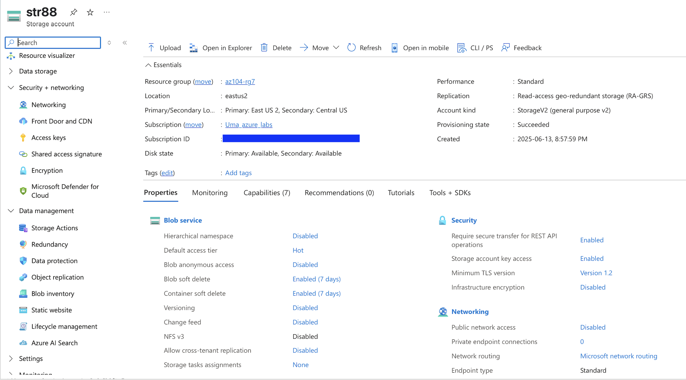
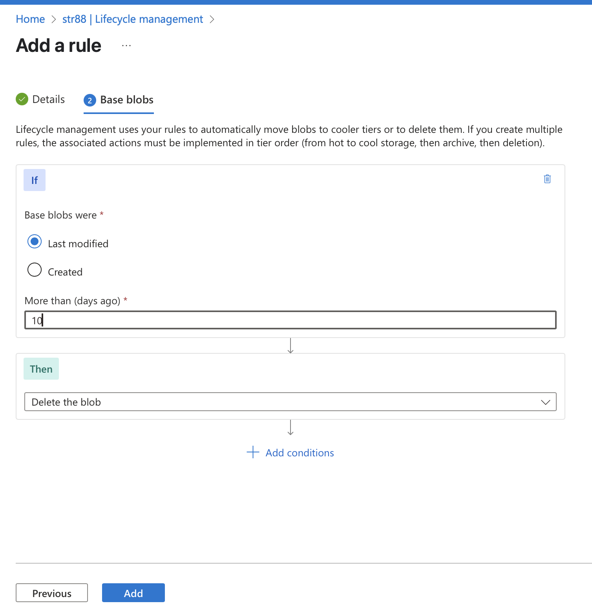

## Azure Storage Account
```
A Storage Account gives you a unique namespace in Azure for your storage data, and defines the performance, redundancy, and access options for stored data. A service that is used to store files, messages, tables, and other types of information.
```
## Storage Account 
```               
    - container - blobs         Image documents, videos, audios, big data, backup files, databases, logs
    - table     - entities      Name=, Enmail=, Date=
    - Queue     - messages      imagesToDownload, imagesTOresize
    - File      - directories   .txt, .exe    
```
## Replication strategies
```
    - LRS:      3Rep 1Reg
    - ZRS:      3Rep 3Zones 1Reg 
    - GRS:      6Rep, 2Regions, 3per Region, Async copy to secondary
    - RA-GRS:   GRS + Read Access, Separate secondary endpoint
    - GZRS:     6Rep, 3+1 Zones, 2 Regions. Sync writes to all 3 zones. Async to secondary
    - RA-GZRS:  GZR + Read Access, Separate secondary endpoint
```

## Types of Data in Azure Storage

```
- Blob Storage
For unstructured data
Types: Block blobs (files), Append blobs (logs), Page blobs (disks)
Supports tiers: Hot, Cool, Archive

- File Storage (Azure Files)
Fully managed file shares (SMB/NFS)
Mountable on Azure and on-prem VMs

- Queue Storage
Message queuing system
Useful for distributed apps to communicate asynchronously

- Table Storage
NoSQL key-attribute store
Lightweight, schema-less, fast
Data Lake Storage Gen2
Optimized for big data analytics
Hierarchical namespace over Blob
```

## Access Storage
```
Container service:  https://<storage_account>.blob.core.windows.net/<container>/<blob-name>
Table service:      https://<storage_account>.table.core.windows.net/<table-name>
Queue service:      https://<storage_account>.queue.core.windows.net/<queue-name>
File service:       https://<storage_account>.file.core.windows.net/<share-name>/<file-name>
```
## Notes

- Can configure customain domain name 
```
CNAME record - blobs.contoso.com
Target - contosoblobs.blob.core.wondows.net
```
- Firewalls and Virtual Networks restrict access to the storage account from specific Subnet on Virtual Networks or public IPs
- Subnets and Virtual Networks must exist in the same Azure Region or Region Pair as the storage account.

## Create and configure a storage account.

- On the Base blobs tab, if based blobs were last modified more than 30 days ago then Move to cool storage. Notice your other choices.





