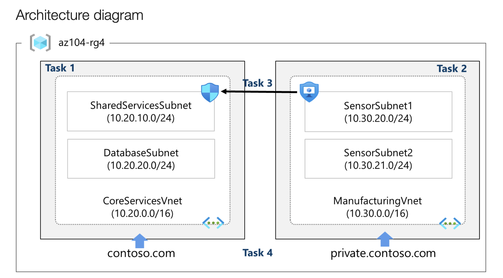
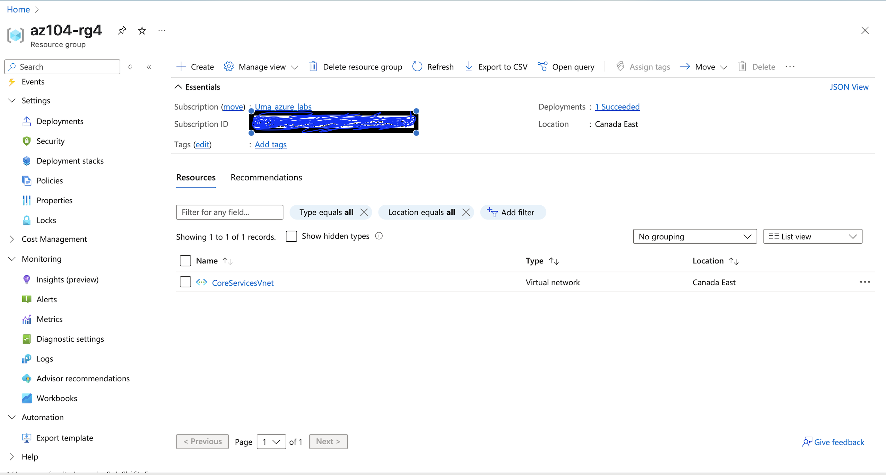
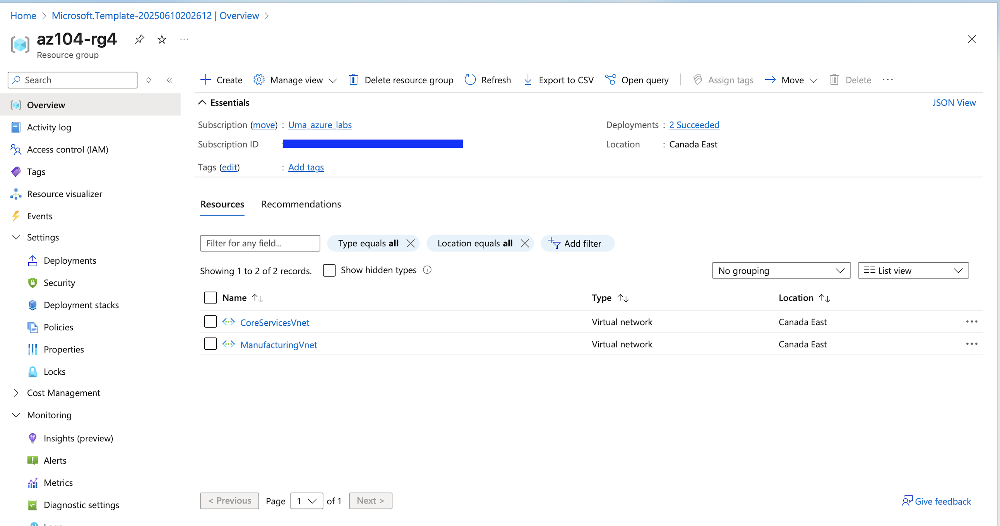
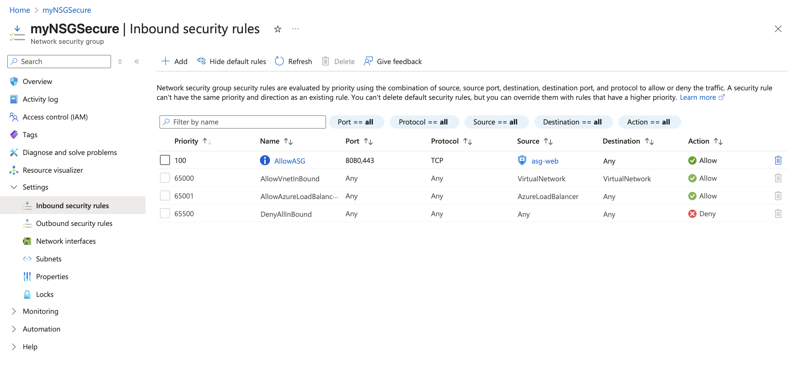
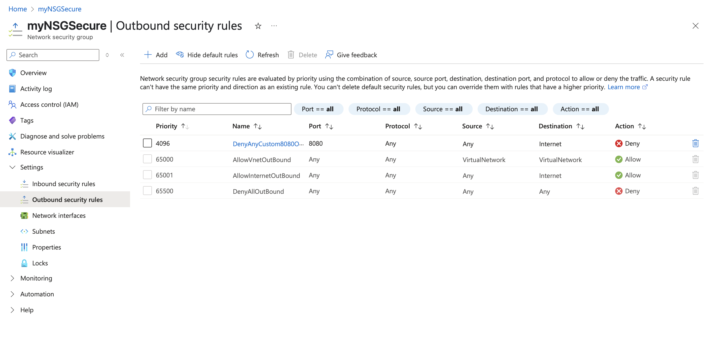

## AZ Governance and Compliance
```
A curated Azure learning path focused on virtual networks, subnets, network security groups, application security groups and hands-on labs.
```
## Overview
```
This repository provides step-by-step labs, scripts, and resources which helped me learn and implement Azure virtual networks, NSG and DNS. 
```

# Azure Virtual Networks, NSG, and DNS Labs

This section of the repository provides hands-on labs and resources for learning about Azure Virtual Networks (VNet), Network Security Groups (NSG), and Domain Name System (DNS) services.

## Overview

- **Virtual Networks (VNet):** Learn how to create and configure VNets to securely connect Azure resources.
- **Network Security Groups (NSG):** Understand how to control inbound and outbound traffic to Azure resources using NSGs.
- **DNS:** Explore Azure DNS for hosting your domain names and managing DNS records.

## Labs Included

1. **Create and Configure a Virtual Network**
   - Set up subnets
   - Connect resources within a VNet

2. **Implement Network Security Groups**
   - Create NSGs and associate them with subnets or NICs
   - Define security rules to allow or deny traffic

3. **Configure Azure DNS**
   - Create a DNS zone
   - Add and manage DNS records
   - Integrate DNS with VNets

## Resources
   - https://microsoftlearning.github.io/AZ-104-MicrosoftAzureAdministrator/

## Lab 04 - Implement Virtual Networking

### Architecture Diagram


### Create a virtual network with subnets using the portal



### Create a virtual network and subnets using a template
[Parameters file](./Files/parameters.json)



### Create and configure communication between an Application Security Group and a Network Security Group
- Create the Application Security Group (ASG)
- Create the Network Security Group and associate it with CoreServicesVnet
- Configure an inbound security rule to allow ASG traffic

- Configure an outbound NSG rule that denies Internet access


### Configure public and private Azure DNS zones

