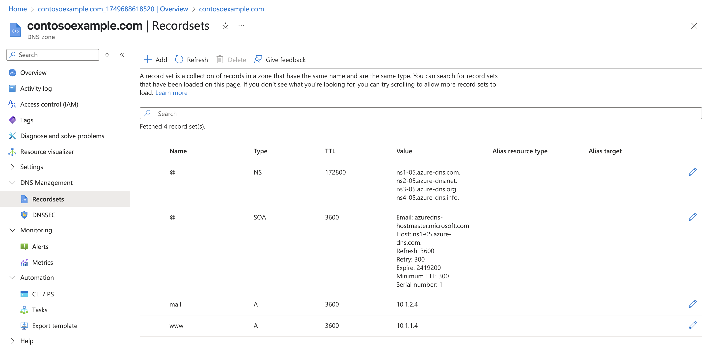
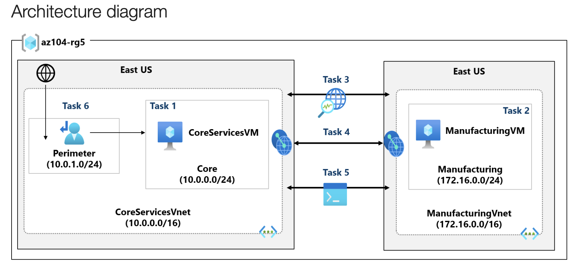
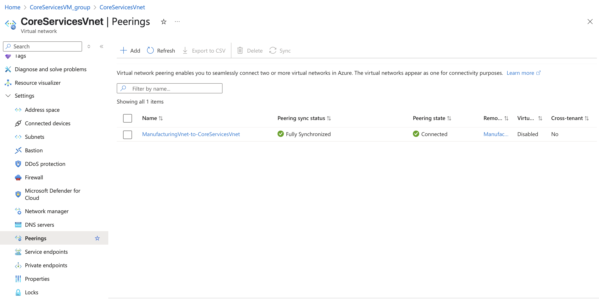
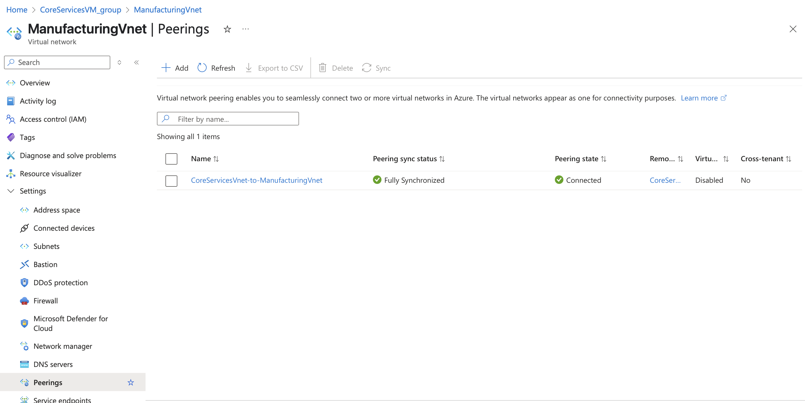
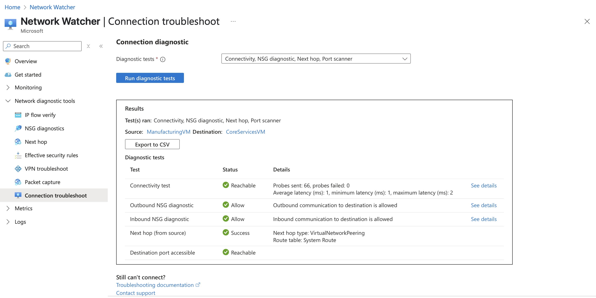
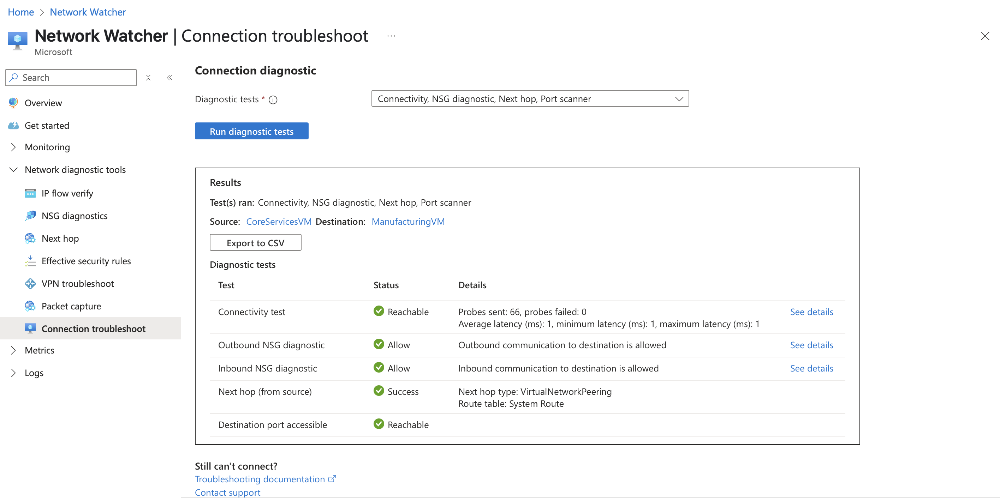
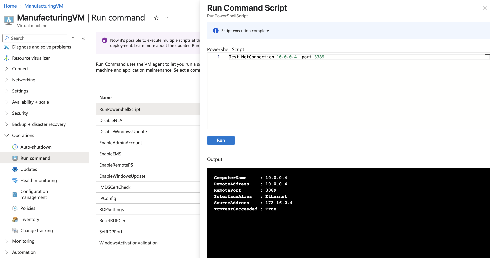
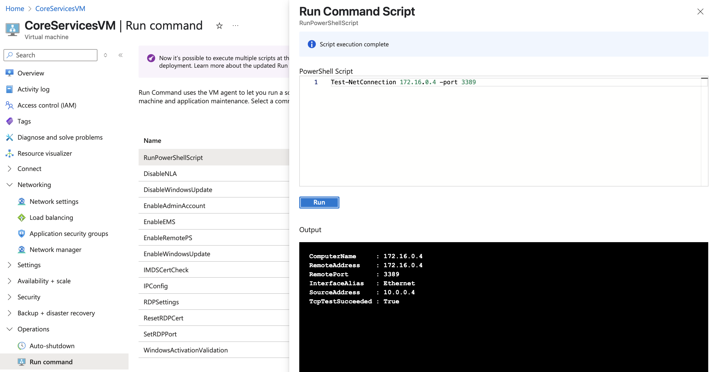
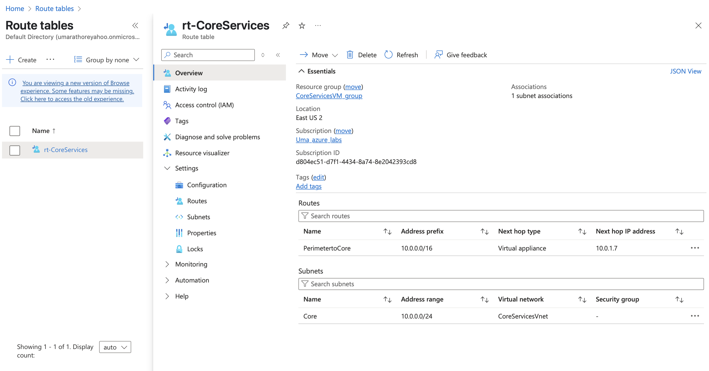

## AZ Governance and Compliance
```
A curated Azure learning path focused on virtual networks, subnets, network security groups, application security groups and hands-on labs.
```
## Overview
```
This repository provides step-by-step labs, scripts, and resources which helped me learn and implement Azure virtual networks, NSG and DNS. 
```

# Azure Virtual Networks, NSG, and DNS Labs

This section of the repository provides hands-on labs and resources for learning about Azure Virtual Networks (VNet), Network Security Groups (NSG), and Domain Name System (DNS) services.

## Overview

- **Virtual Networks (VNet):** Learn how to create and configure VNets to securely connect Azure resources.
- **Network Security Groups (NSG):** Understand how to control inbound and outbound traffic to Azure resources using NSGs.
- **DNS:** Explore Azure DNS for hosting your domain names and managing DNS records.

## Labs Included

1. **Create and Configure a Virtual Network**
   - Set up subnets
   - Connect resources within a VNet

2. **Implement Network Security Groups**
   - Create NSGs and associate them with subnets or NICs
   - Define security rules to allow or deny traffic

3. **Configure Azure DNS**
   - Create a DNS zone
   - Add and manage DNS records
   - Integrate DNS with VNets

4. **Implement Intersite Connectivity**   

## Resources
   - https://microsoftlearning.github.io/AZ-104-MicrosoftAzureAdministrator/

## Lab 04 - Implement Virtual Networking

### Architecture Diagram


### Create a virtual network with subnets using the portal


### Create a virtual network and subnets using a template
- refer virtual_networks/Files/parameters.json
- refer virtual_networks/Files/template.json


### Create and configure communication between an Application Security Group and a Network Security Group
- Create the Application Security Group (ASG)
- Create the Network Security Group and associate it with CoreServicesVnet
- Configure an inbound security rule to allow ASG traffic

- Configure an outbound NSG rule that denies Internet access


### Notes
- NSG Limits network traffic to resources in virtual network
- It list security rules that allow or deny inbound or outbound network traffic. There are deafult security rules which cannot be deleted, but new rules can be added with a higher priority
- Associated with subnets or NIC. Can be associated multiple times.
- NSG is applied on NICs or subnets
- ASG logically group virtual machines - web servers, application servers.
- ASG is applied only at subnets. It can used as source or destination in NSG
- Public IP Addresses, can be associated with VM interface, internet facing LoadBalancers, VPN gateways and Application gateways.


### Configure public and private Azure DNS zones

- When a new tenant is created, a new default doman is created.
- A DNS zone host DNS records for a domain.
- Root/Parent domain is registered at the registrar and pointed to Azure NS
- When delegating a domain to Azure DNS, you must use the name server names provided by Azure DNS all Four of them.


- A Record set is a collection of records in a zone that have the same name and are the same type.
- 20 records can be added to any record set
- A Record set cannot contain two identical record




- Use custom domain names. 
- Provides name resolution for VMs within a VNET and between VNETS


### Lab 05 - Implement Intersite Connectivity
```
This lab covers communication between virtual networks. You implement virtual network peering and test connections. You will also create a custom route. Connectivity between the segmented areas. This is a common scenario for separating production from development or separating one subsidiary from another.
```

### Architecture Diagram



- Create a core services virtual machine and virtual network
- Create a virtual machine in a different virtual network
- Use Network Watcher to test the connection between virtual machines
- Notice the Connectivity test shows UnReachable. This makes sense because the virtual machines are in different virtual networks.
```
IP FLow: 
Checks the flow if a packet is allowed or denied by a VM based on 5-tuple information. The security group decision and name of the rule is returned. Specify a target virtual machine with associated network security groups, then run an inbound or outbound packet to see if access is allowed or denied.

NSG Diagnostics:
The Network Security Group Diagnostics tool provides detailed information to understand and debug the security configuration of your network. For a given source-destination pair, network security group diagnostics returns all network security groups that will be traversed, the rules that will be applied in each network security group, and the final allow/deny status for the flow.

Next Hop:
Next Hop provides the next hop from the target virtual machine to the destination IP address.

VPN Troubleshoot:
Network Watcher VPN Troubleshoot diagnoses the health of the virtual network gateway or connection

Connection Troubleshoot 
Network Watcher connection troubleshoot provides the capability to check a direct TCP or ICMP connection from a virtual machine (VM), application gateway v2, or Bastion host to a VM, fully qualified domain name (FQDN), URI, or IP address
```
### Failed connection tested using Network Watcher


### Configure virtual network peerings between virtual networks





### Use Network Watcher to test the connection between virtual machines





### Use Azure PowerShell to test the connection between virtual machines





### Create a custom route
```
When you associate a custom route table to a subnet, and it contains a route that matches the destination IP prefix, Azure uses your route instead of the system route.

Here all outbound traffic from Core subnet will be routed to PerimeterCore subnet IP 10.0.1.7 as a firewall. Directs traffic to custom next hops (like firewalls, VPNs, or drop)
```
